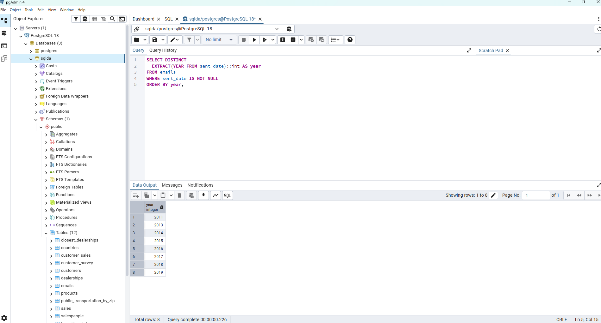
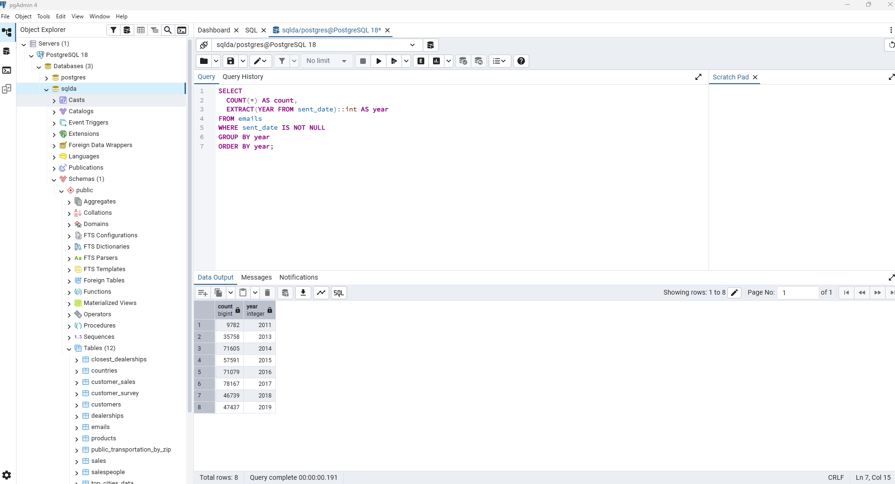
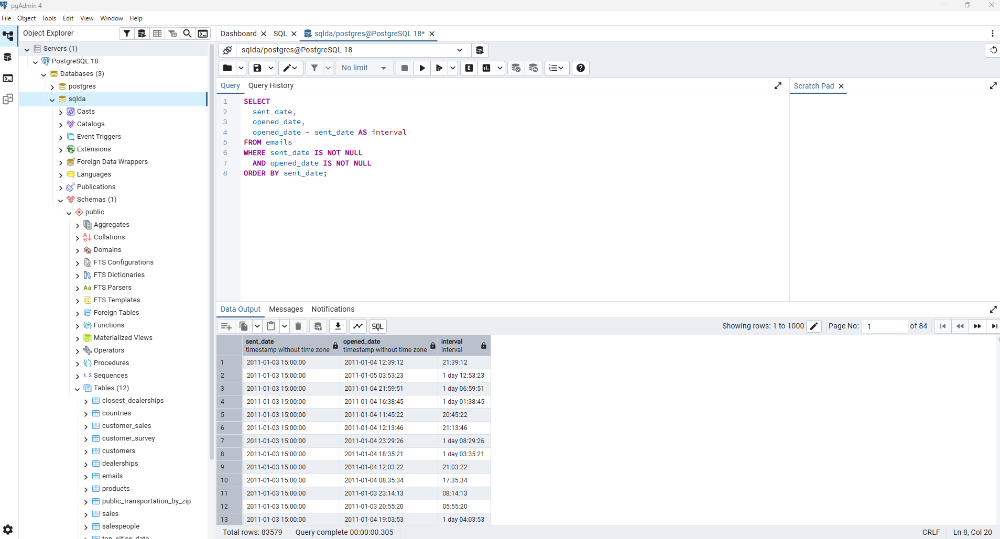
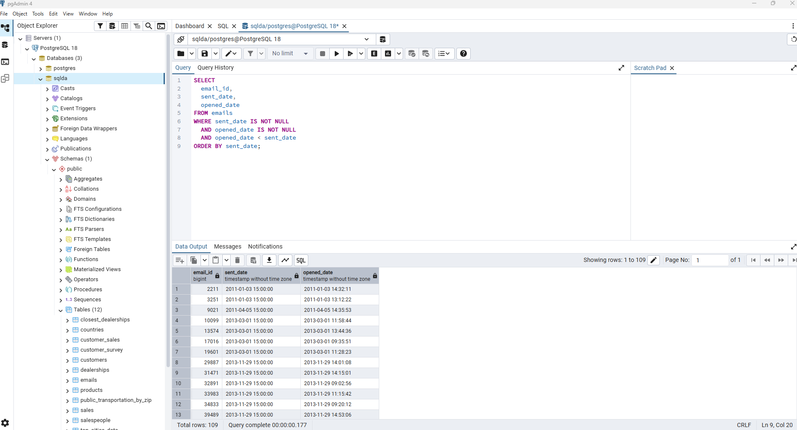
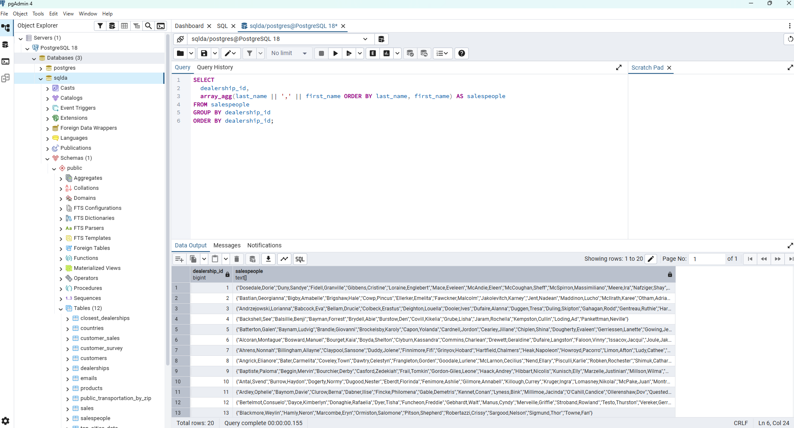
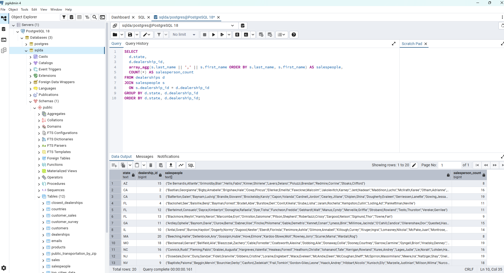

# Exercise 05: SQLDA Database - Dates, Data Quality, Arrays, and JSON

- Name: Karli Dean
- Course: Database for Analytics
- Module: 5
- Database Used:  `sqlda` (Sample Datasets)
- Tools Used: PostgreSQL (pgAdmin or psql)

---

## Instructions

- Use the **sqlda** database from the "Loading the Sample Datasets" instructions.
- For each SQL task:
  - Include your SQL in a fenced code block
  - Execute it and include a **screenshot** showing the query and results
- Store screenshots in the `screenshots/` folder and embed them below each answer.
- For explanation questions:
  - Write your answer in complete sentences
  - Include a screenshot if requested

---

## Question 1

Using the `sqlda` database, write the SQL needed to show a **list of years** that emails were sent.

Your results should list years like this (order matters):

```
year
2011
2013
2014
2015
2016
2017
2018
2019
```

### SQL

```sql
SELECT DISTINCT
  EXTRACT(YEAR FROM sent_date)::int AS year
FROM emails
WHERE sent_date IS NOT NULL
ORDER BY year;
```

### Screenshot



---

## Question 2

Using the `sqlda` database, write the SQL needed to show the **number of messages sent by year**, ordered by year (as shown in the prompt).

Output should resemble:

```
count   year
...
```

### SQL

```sql
SELECT
  COUNT(*) AS count,
  EXTRACT(YEAR FROM sent_date)::int AS year
FROM emails
WHERE sent_date IS NOT NULL
GROUP BY year
ORDER BY year;
```

### Screenshot



---

## Question 3

Using the `sqlda` database, write the SQL needed to show:
- the **sent date**
- the **opened date**
- the **interval** between the two

Only include emails that contain **both** a sent date and an opened date.

### SQL

```sql
SELECT
  sent_date,
  opened_date,
  opened_date - sent_date AS interval
FROM emails
WHERE sent_date IS NOT NULL
  AND opened_date IS NOT NULL
ORDER BY sent_date;
```

### Screenshot



---

## Question 4

Using the `sqlda` database, write the SQL needed to show emails that contain an **opened date BEFORE the sent date**.

### SQL

```sql
SELECT
  email_id,
  sent_date,
  opened_date
FROM emails
WHERE sent_date IS NOT NULL
  AND opened_date IS NOT NULL
  AND opened_date < sent_date
ORDER BY sent_date;
```

### Screenshot



---

## Question 5

Using the `sqlda` database: there are **over 100 emails** that contain an opened date **BEFORE** the sent date.

After looking at the data, **why is this the case?**

### Answer

This happens because the opened_date values are not reliable “real open timestamps.” In the sample dataset, many opened_date entries appear to be generated/loaded incorrectly (common causes: timestamp fields imported with the wrong time zone, a swapped/incorrect source column, or placeholder/default “opened” dates that don’t reflect actual user behavior). As a result, some rows end up with an opened_date earlier than sent_date, which is a data quality issue rather than a real-world possibility.

### Screenshot (if requested by instructor)


---

## Question 6

Using the `sqlda` database, explain in your own words what the following code does:

```sql
CREATE TEMP TABLE customer_points AS (
    SELECT
        customer_id,
        point(longitude, latitude) AS lng_lat_point
    FROM customers
    WHERE longitude IS NOT NULL
    AND latitude IS NOT NULL
);

CREATE TEMP TABLE dealership_points AS (
    SELECT
        dealership_id,
        point(longitude, latitude) AS lng_lat_point
    FROM dealerships
);

CREATE TEMP TABLE customer_dealership_distance AS (
    SELECT
       customer_id,
       dealership_id,
       c.lng_lat_point <@> d.lng_lat_point AS distance
    FROM customer_points c
    CROSS JOIN dealership_points d
);
```

### Answer

This code builds two temporary tables containing geographic points (longitude/latitude) for customers and dealerships, then calculates the distance between every customer and every dealership.

customer_points: stores each customer’s customer_id and a Postgres point(longitude, latitude) value, but only for customers with non-null coordinates.

dealership_points: stores each dealership’s dealership_id and its point(longitude, latitude).

customer_dealership_distance: cross joins customers to dealerships (so every customer is paired with every dealership) and uses the <@> operator to compute the distance between the two points, saving it as distance.

---

## Question 7

Using the `sqlda` database, write SQL to display an **array of salespeople for each dealership**, sorted by dealership.

For example - dealership 1 is below:

```text
"{""Fidell,Granville"",""Onele,Jereme"",""Sheriff,Lelia"",""McSpirron,Massimiliano"",""Rennick,Nadia"",""Mace,Eveleen"",""Oxteby,Dukie"",""Spong,Marcos"",""Wogden,Quent"",""Duny,Sandye"",""Loraine,Englebert"",""Meere,Ira"",""Gibbens,Cristine"",""Prine,Lyda"",""McCoughan,Sheff"",""Schule,Giselbert"",""McAndie,Eleen"",""Dosedale,Dorie"",""Nafziger,Shay""}"
```

### SQL

```sql
SELECT
  dealership_id,
  array_agg(last_name || ',' || first_name ORDER BY last_name, first_name) AS salespeople
FROM salespeople
GROUP BY dealership_id
ORDER BY dealership_id;
```

### Screenshot



---

## Question 8

Using the `sqlda` database, write SQL to display:
- an **array of salespeople for each dealership**
- the **state** of the dealership
- the **number of salespeople** for the dealership

Sort by **state**.

Reference image:


### SQL

```sql
SELECT
  d.state,
  d.dealership_id,
  array_agg(s.last_name || ',' || s.first_name ORDER BY s.last_name, s.first_name) AS salespeople,
  COUNT(*) AS salesperson_count
FROM dealerships d
JOIN salespeople s
  ON s.dealership_id = d.dealership_id
GROUP BY d.state, d.dealership_id
ORDER BY d.state, d.dealership_id;
```

### Screenshot



---

## Question 9

Using the `sqlda` database, write the SQL needed to convert the **customers** table to **JSON**.

### SQL

```sql
SELECT to_jsonb(c) AS customer_json
FROM customers c;
```

### Screenshot


---

## Question 10

Using the `sqlda` database, write SQL to display:
- an **array of salespeople for each dealership**
- the **state**
- the **number of salespeople**
- sorted by **state**

Then **convert this result to JSON**.

Reference image:


### SQL

```sql
SELECT to_jsonb(t) AS result_json
FROM (
  SELECT
    d.state,
    d.dealership_id,
    array_agg(s.last_name || ',' || s.first_name ORDER BY s.last_name, s.first_name) AS salespeople,
    COUNT(*) AS salesperson_count
  FROM dealerships d
  JOIN salespeople s
    ON s.dealership_id = d.dealership_id
  GROUP BY d.state, d.dealership_id
  ORDER BY d.state, d.dealership_id
) t;
```

### Screenshot


