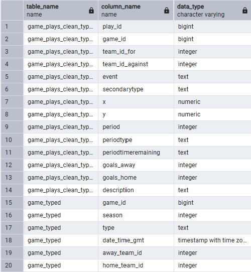

# NHL Game Data – Database for Analytics Final Project  
**Name:** Karli Dean  
**Course:** Database for Analytics  

---

## 1. Initial Data Source

The initial data source used for this project was NHL game data from Kaggle:

https://www.kaggle.com/datasets/martinellis/nhl-game-data

The dataset contains detailed historical NHL game data, including:

- Game-level summaries  
- Play-by-play event data  
- Player information  

The specific CSV files used for this project were:

- `game.csv`
- `game_plays.csv`
- `player_info.csv`

These files were loaded into PostgreSQL using pgAdmin4 and organized within the `raw` schema.

---

## 2. Data Overview

### Table: `game`
- **Rows:** 26,305  
- **Columns:** 15  

| Column | Description |
|--------|------------|
| game_id | Unique identifier for each NHL game |
| season | NHL season in which the game was played (e.g., 20182019) |
| type | Game type (regular season, playoff, etc.) |
| date_time_gmt | Date and time the game occurred (GMT) |
| away_team_id | Unique identifier for the away team |
| home_team_id | Unique identifier for the home team |
| away_goals | Total goals scored by the away team |
| home_goals | Total goals scored by the home team |
| outcome | Final result of the game |
| home_rink_side_start | Direction defended by home team at start |
| venue | Arena where the game was played |
| venue_link | Reference link for the venue |
| venue_time_zone_id | Venue time zone identifier |
| venue_time_zone_offset | Time difference from GMT |
| venue_time_zone_tz | Time zone abbreviation |

---

### Table: `game_plays`
- **Rows:** 5,050,529  
- **Columns:** 20  

| Column | Description |
|--------|------------|
| play_id | Unique identifier for each recorded play event |
| game_id | Identifier linking play to game |
| team_id_for | Team responsible for event |
| team_id_against | Opposing team |
| event | Event type (shot, goal, hit, faceoff, etc.) |
| secondarytype | Additional event subtype detail |
| x | X-coordinate of event location |
| y | Y-coordinate of event location |
| period | Game period |
| periodtype | Type of period |
| period_time | Time elapsed in period |
| periodtimeremaining | Time remaining in period |
| datetime | Event timestamp |
| goals_away | Away team goals at time of event |
| goals_home | Home team goals at time of event |
| description | Text description of event |
| st_x | Standardized X coordinate |
| st_y | Standardized Y coordinate |
| event_ts | Event sequence timestamp |
| goals_home_num | Numeric representation of home goals |

---

### Table: `player_info`
- **Rows:** 3,925  
- **Columns:** 12  

| Column | Description |
|--------|------------|
| player_id | Unique identifier for each player |
| firstname | Player first name |
| lastname | Player last name |
| nationality | Player country |
| birthcity | City of birth |
| primaryposition | Primary playing position |
| birthdate | Date of birth |
| birthstateprovince | State or province of birth |
| height | Original height format |
| height_cm | Height in centimeters |
| weight | Player weight |
| shootscatches | Shooting/catching hand |

---

## 3. Data Transformation and Refinement

### Column Reduction

The original `game_plays` table contained 20 attributes.  
To improve analytical focus and performance, a curated table called `game_plays_clean` was created containing only:

- play_id  
- game_id  
- team_id_for  
- team_id_against  
- event  
- secondarytype  
- period  
- periodtype  
- periodtimeremaining  
- goals_home  
- goals_away  
- x  
- y  
- description  

This refinement preserved the grain of play-level analysis while removing unnecessary attributes.

---

### Data Type Corrections

All CSV fields initially loaded as TEXT.  
To enforce proper schema structure, typed versions of each table were created:

- `game_typed`
- `game_plays_clean_typed`
- `player_info_typed`

During this process:

- “NA” string values were converted to NULL using `NULLIF()`
- Integer identifiers were cast to INT/BIGINT
- Numeric values (goals, coordinates, height_cm) were cast appropriately
- Date fields were converted to DATE or TIMESTAMP types

---

### Challenges Encountered

- Loading over 5 million play records stressed system performance.
- All attributes initially imported as TEXT.
- “NA” values caused casting errors during numeric conversion.
- Schema awareness was required (`raw` schema vs `public`).

These issues were resolved using schema-qualified queries and controlled table recreation.

---

The table of data types is now as follows:


## 4. SELECT Query Examples

### All Games Held at United Center

```sql
SELECT *
FROM raw.game_typed
WHERE venue ILIKE '%United Center%';
```
